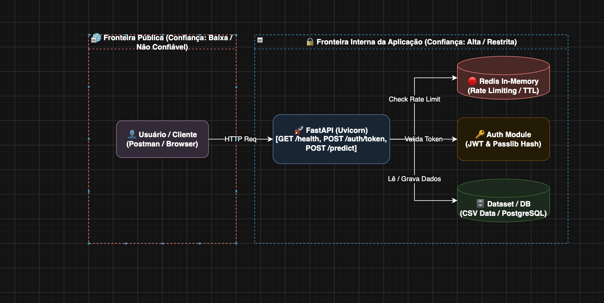

# FintechGuard 🛡️

Sistema de atendimento bancário com foco em análise de dados, segurança da informação e inteligência artificial, aplicando mecanismos avançados contra fraudes bancárias, ataques de força bruta (*brute-force*) e prevenção contra vazamento de dados (*DLP*).

---

## 🎯 Objetivo do Projeto

O **FintechGuard** é o projeto desenvolvido para o **Projeto de Bloco: Análise e Segurança de Agentes de IA**, com o objetivo de construir a base de um sistema de atendimento ao cliente inteligente, seguro e escalável utilizando:

* Análise Exploratória de Dados (EDA) rigorosa;
* API modular com FastAPI;
* Autenticação e segurança utilizando JWT e OAuth2;
* Rate Limiting com Redis;
* Aplicação da Tríade CIA;
* Containerização via Docker e Docker Compose.

---

## 📄 Licença e Documentação do Dataset

* **Nome:** Customer Support Ticket Dataset
* **Fonte:** [Kaggle - Customer Support Ticket Dataset](https://www.kaggle.com/datasets/suraj520/customer-support-ticket-dataset?resource=download)
* **Licença:** Apache 2.0
* **Justificativa da Escolha:** O dataset possui 8.470 amostras, superando o requisito mínimo de 500, contendo colunas essenciais de texto (`Ticket Description`, `Ticket Subject`), categorias de intenção (`Ticket Type`), prioridades e métricas de tempo de atendimento, ideais para o treinamento futuro de agentes de IA.

---

## 🔒 Segurança, DFD e Modelagem de Ameaças

### 📐 Diagrama de Fluxo de Dados (DFD) e Trust Boundaries



### 🛡️ Aplicação da Tríade CIA por Componente

* **Confidencialidade (C):** Proteção de dados sensíveis dos clientes (PII como `Customer Name` e `Customer Email`). Aplicação de JWT OAuth2 e hashing de senhas com `bcrypt`. Separação de segredos via `.env`.
* **Integridade (I):** Garantia de que os dados de chamados e predições não sejam alterados indevidamente por usuários não autorizados. Validação rígida de esquemas com **Pydantic**.
* **Disponibilidade (A):** Proteção do sistema contra ataques DoS/força bruta usando **Rate Limiting dinâmico no Redis**, com chave `login_attempts:<ip>:<username>`, expiração TTL de 180 segundos e resposta HTTP 429.

---

## 📊 Dataset e Análise Exploratória (EDA)

Após a execução da EDA via Pandas (`scripts/eda.py`):

* **Registros:** 8.470 linhas
* **Colunas:** 20
* **Duplicatas:** nenhuma identificada.

### Detalhamento das Colunas

| Nome da Coluna                 | Tipo                 | Categoria / Observação                                |
| ------------------------------ | -------------------- | ----------------------------------------------------- |
| `Customer Name`                | Texto (`str`)        | PII (Dado Sensível)                                   |
| `Customer Email`               | Texto (`str`)        | PII (Dado Sensível)                                   |
| `Customer Gender`              | Texto (`str`)        | Demográfico                                           |
| `Product Purchased`            | Texto (`str`)        | Produto/Serviço                                       |
| `Date of Purchase`             | Texto (`str`)        | Data de Compra                                        |
| `Ticket Type`                  | Texto (`str`)        | Categoria de Intenção                                 |
| `Ticket Subject`               | Texto (`str`)        | Assunto do Chamado                                    |
| `Ticket Description`           | Texto (`str`)        | Descrição Textual                                     |
| `Ticket Status`                | Texto (`str`)        | Estado de Resolução                                   |
| `Resolution`                   | Texto (`str`)        | Solução Aplicada                                      |
| `Ticket Priority`              | Texto (`str`)        | Nível de Prioridade                                   |
| `Ticket Channel`               | Texto (`str`)        | Canal de Atendimento                                  |
| `First Response Time`          | Texto (`str`)        | Métrica de Tempo                                      |
| `Time to Resolution`           | Texto (`str`)        | Métrica de Tempo                                      |
| `Customer Satisfaction Rating` | Numérica (`float64`) | Satisfação (1 a 5)                                    |
| `Unnamed: 17` a `19`           | Numérica (`float64`) | Inconsistências identificadas para remoção na limpeza |

### 💡 Hipóteses sobre as Intenções dos Usuários

1. **Predominância de Problemas Técnicos em Produtos Específicos:** A maior frequência de tickets do tipo `"Technical Issue"` está associada a compras recentes, indicando necessidade de autoatendimento via IA.

2. **Impacto do Tempo de Primeira Resposta na Satisfação:** Clientes com `First Response Time` elevado tendem a atribuir notas de satisfação mais baixas, sugerindo que a IA deve priorizar a triagem imediata desses casos.

3. **Canal Preferencial por Prioridade:** Chamados de prioridade alta entram predominantemente por canais síncronos (chat/telefone), exigindo roteamento prioritário.

---

## 🛠️ Tecnologias Utilizadas

### Backend

* Python 3.12+
* FastAPI
* Uvicorn
* Pydantic
* SQLAlchemy

### Segurança e Estado

* Redis
* JWT (`python-jose` / `pyjwt`)
* Passlib (`bcrypt`)
* OAuth2PasswordBearer

### Análise de Dados

* Pandas
* NumPy
* Matplotlib
* Seaborn

### Containers e Testes

* Docker
* Docker Compose
* Postman

---

## 📂 Estrutura do Projeto

```text
FINTECHGUARD/
│
├── data/
│   ├── customer_support_tickets.csv    # Dataset base
│   └── db.py                            # Carregamento do dataset
│
├── models/
│   └── model_events.py                  # Mapeamento de entidades
│
├── router/
│   ├── auth_router.py                   # Rota POST /auth/token (e /auth/login)
│   ├── predict_router.py                # Rota POST /predict (Placeholder)
│   └── ticket_router.py                 # Rotas CRUD
│
├── schemas/
│   ├── auth.py                          # Schemas Pydantic
│   └── ticket.py                        # Schemas Pydantic
│
├── scripts/
│   └── eda.py                           # Script de Análise Exploratória
│
├── utils/
│   ├── auth.py                          # Lógica JWT e OAuth2
│   ├── rate_limiter.py                  # Controle Redis
│   └── helpers.py                       # Funções DRY
│
├── Dockerfile                           # Container da API
├── docker-compose.yml                   # Orquestração API + Redis
├── main.py                              # Entrada FastAPI com GET /health
└── requirements.txt
```

---

## 🌐 Rotas Principais da API

| Método | Endpoint      | Autenticação           | Descrição                                           |
| ------ | ------------- | ---------------------- | --------------------------------------------------- |
| `GET`  | `/health`     | Não                    | Retorna o status de funcionamento da API (`200 OK`) |
| `POST` | `/auth/token` | Não                    | Autentica o usuário e retorna o JWT Bearer          |
| `POST` | `/predict`    | **Sim (Bearer Token)** | Endpoint placeholder para o modelo de IA futuro     |

---

## ⚙️ Como Executar o Projeto

O FintechGuard pode ser executado de duas formas: utilizando **Docker Compose**, recomendado para facilitar a configuração do ambiente, ou diretamente no ambiente Python utilizando **Uvicorn**.

### 🐳 Opção 1: Via Docker Compose

Com o Docker instalado e em execução:

```bash
docker compose up --build -d
```

Para acompanhar os logs:

```bash
docker compose logs -f
```

Para encerrar os serviços:

```bash
docker compose down
```

O Docker Compose é responsável por inicializar os serviços necessários para a aplicação, incluindo a API FastAPI e o Redis utilizado pelo sistema de **Rate Limiting**.

### 🐍 Opção 2: Localmente via Uvicorn

Para executar o projeto diretamente no ambiente Python:

#### 1. Criar e ativar o ambiente virtual

```bash
python3 -m venv venv
source venv/bin/activate
```

No Windows:

```powershell
.\venv\Scripts\activate
```

#### 2. Instalar as dependências

```bash
pip install -r requirements.txt
```

#### 3. Iniciar o servidor Redis

Como a API utiliza Redis para o controle de tentativas de autenticação e Rate Limiting, o serviço Redis precisa estar ativo.

Uma opção é executar o Redis utilizando Docker:

```bash
docker run --name fintech-redis -p 6379:6379 -d redis:alpine
```

#### 4. Executar a API com Uvicorn

```bash
uvicorn main:app --reload
```

#### 5. Executar a Análise Exploratória

```bash
python scripts/eda.py
```

---

## 📌 Execução em uma Nova Máquina

O projeto pode ser executado em outro computador utilizando Docker ou configurando o ambiente Python manualmente.

### Docker

Se a nova máquina possuir Docker, a forma recomendada é:

```bash
docker compose up --build
```

Essa abordagem evita a necessidade de instalar manualmente o Redis e configurar individualmente todas as dependências do ambiente.

### Ambiente Python

Caso o Docker não esteja disponível, é possível utilizar o ambiente Python diretamente, desde que estejam disponíveis:

* Python instalado;
* Ambiente virtual (`venv`);
* Dependências instaladas através do `requirements.txt`;
* Redis em execução;
* Variáveis de ambiente configuradas conforme o `.env.example`.

---

## 🌐 Links de Acesso

Após iniciar a aplicação:

* **API Health:** `http://localhost:8000/health`
* **Swagger UI:** `http://localhost:8000/docs`

---

## 🤖 Declaração do Uso de Ferramentas de IA

Em conformidade com as diretrizes do curso, declara-se que ferramentas de Inteligência Artificial (**Gemini**) foram utilizadas neste trabalho como auxílio para:

* Refatoração e otimização de scripts de teste no Postman;
* Estruturação e organização visual da documentação técnica e diagramas Mermaid;
* Revisão de boas práticas na arquitetura de segurança contra força bruta.

---

## 👥 Autores

* **Weslley Soares**
* **Bruno Santos**
