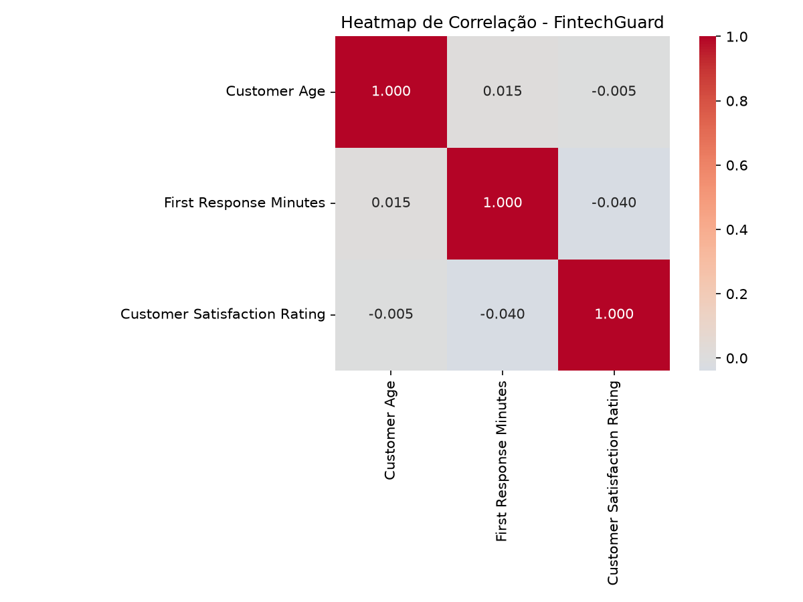
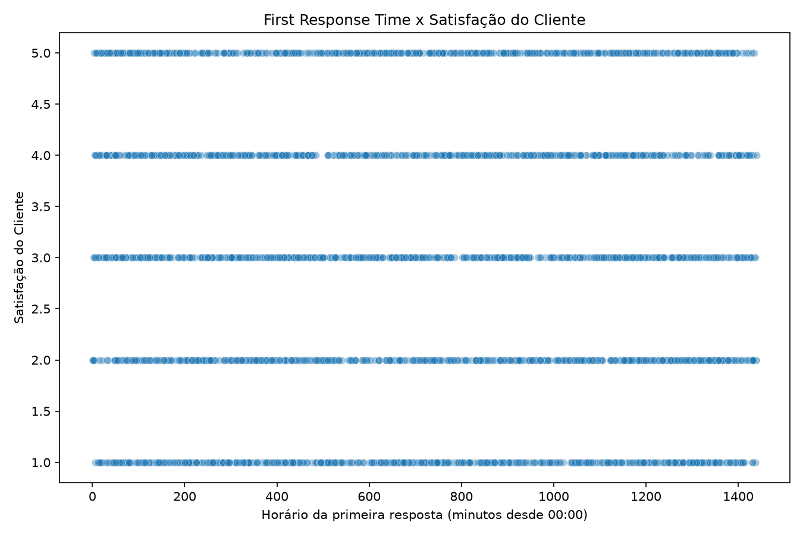
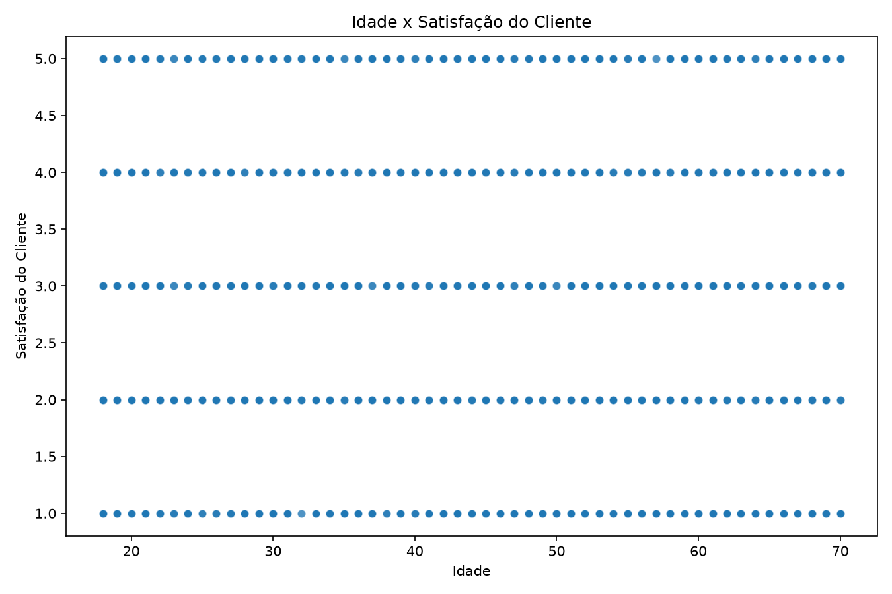
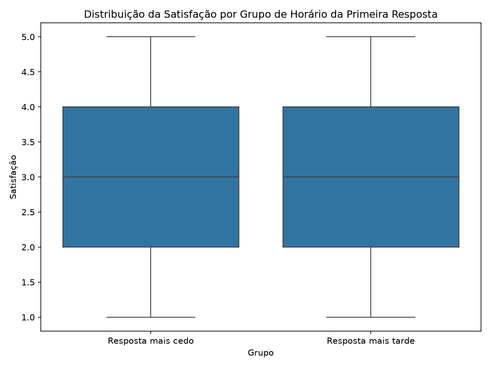

# FintechGuard — Atendimento Bancário

> API de atendimento bancário desenvolvida com foco em segurança, proteção de dados, análise exploratória e futura aplicação de Inteligência Artificial.


---

## 📚 Sobre o projeto

O **FintechGuard** é um projeto acadêmico desenvolvido no curso de Engenharia de Software, com foco na construção de uma API de atendimento bancário segura.

O projeto trabalha principalmente com:

- autenticação e autorização;
- proteção contra acesso indevido a recursos;
- validação de dados;
- proteção contra brute force;
- headers de segurança;
- análise exploratória de dados;
- testes automatizados de segurança;
- auditoria utilizando ZAP;
- preparação para futura implementação de agentes de IA seguros.

### Projeto acadêmico

**Projeto de Bloco:** Análise e Segurança de Agentes de IA [26E3_5]

**Professor:** Ricardo Pires Mesquita

**Alunos:**
- Weslley Soares
- Bruno Santos

---

# 🎯 Objetivo

O objetivo do FintechGuard é desenvolver uma aplicação de atendimento bancário que permita trabalhar com dados de tickets de clientes e, ao mesmo tempo, aplicar controles de segurança desde a entrada dos dados até a autorização dos recursos.

No TP2, a competência integradora é:

> **Implementar análise estatística completa e controles OWASP Top 10 na API FastAPI auditada por ZAP.**

---

# 🧩 TP2

O TP2 possui sete requisitos principais:

| # | Requisito | Status |
|---|---|---|
| 1 | EDA avançada com heatmap, scatter plots e teste de hipótese | 🟢 Implementado |
| 2 | Controles OWASP na API | 🟢 Implementado |
| 3 | Headers de segurança e CORS | 🟢 Implementado |
| 4 | Rate limiting no `/auth/token` | 🟢 Implementado |
| 5 | Passive Scan com ZAP | 🟢 Implementado |
| 6 | Testes de segurança com Pytest | 🟢 Implementado |
| 7 | Relatório estruturado da EDA | 🟢 Implementado |

### Documentação do TP2

- [📄 Relatório do TP1](README.MD)
- [📊 Relatório de EDA](scripts/README_EDA_02.md)
- [🛡️ Findings do ZAP](docs/owasp_zap_report.md)

---

# 🏗️ Arquitetura

A arquitetura atual pode ser representada da seguinte forma:

```text
                    ┌──────────────────────┐
                    │      Frontend        │
                    │   HTML / CSS / JS    │
                    └──────────┬───────────┘
                               │
                               ▼
                    ┌──────────────────────┐
                    │       FastAPI        │
                    ├──────────────────────┤
                    │ JWT / bcrypt         │
                    │ Pydantic             │
                    │ BOLA                 │
                    │ Rate Limiting        │
                    │ CORS                 │
                    │ Security Headers     │
                    └──────────┬───────────┘
                               │
                 ┌─────────────┴─────────────┐
                 ▼                           ▼
        ┌─────────────────┐         ┌─────────────────┐
        │    SQLModel     │         │      Redis      │
        │     SQLite      │         │ Rate Limiting  │
        └─────────────────┘         └─────────────────┘
````

---

# 🗄️ Modelo de dados

Relacionamento principal:

```text
User
 │
 │ 1:N
 ▼
Ticket
 │
 │ 1:N
 ▼
ConversationMessage
```

### User

Representa o usuário autenticado da aplicação.

### Ticket

Representa uma solicitação de atendimento.

### ConversationMessage

Representa mensagens relacionadas à conversa de um ticket.

---

# 🛠️ Tecnologias

## Backend

* Python 3.13.5
* FastAPI
* SQLModel
* SQLAlchemy
* Alembic
* Pydantic
* JWT
* bcrypt

## Banco de dados

* SQLite atualmente
* PostgreSQL previsto para evolução

## Segurança

* JWT
* bcrypt
* Redis
* CORS
* CSP
* HSTS
* X-Frame-Options
* X-Content-Type-Options
* BOLA protection
* Pydantic `extra="forbid"`
* OWASP ZAP

## Análise de dados

* Pandas
* NumPy
* Matplotlib
* Seaborn
* SciPy
* Jupyter Notebook

## Testes

* Pytest
* FastAPI TestClient

---

# 📁 Estrutura do projeto

```text
FintechGuard/
│
├── data/
│   ├── customer_support_tickets.csv
│   └── customer_support_tickets_anomalies.csv
│
├── graphs/
│   ├── eda_visualizations.png
│   ├── heatmap_correlacao.png
│   ├── scatter_resposta_satisfacao.png
│   ├── scatter_idade_satisfacao.png
│   └── boxplot_resposta_satisfacao.png
│
├── scripts/
│   ├── eda.py
│   └── README_EDA_02.md
│
├── docs/
│   ├── TP2.md
│   ├── EDA_REPORT.md
│   ├── ZAP_FINDINGS.md
│   └── images/
│
├── reports/
│   └── zap_report_tp2.html
│
├── tests/
│   └── test_security.py
│
├── router/
├── schemas/
├── models/
├── utils/
├── templates/
├── static/
│
├── main.py
├── alembic.ini
├── requirements.txt
└── README.md
```

---

# 🔐 Controles de segurança

## 1. Autenticação JWT

A API utiliza JWT para proteger os endpoints que exigem autenticação.

O cliente envia:

```http
Authorization: Bearer <token>
```

Tokens inválidos ou ausentes resultam em:

```text
401 Unauthorized
```

---

# 🔑 2. Senhas com bcrypt

As senhas não são armazenadas em texto puro.

O projeto utiliza `bcrypt` para:

* gerar hash;
* armazenar o hash;
* verificar a senha durante o login.

---

# 🧱 3. Pydantic `extra="forbid"`

Os modelos de entrada utilizam:

```python
model_config = ConfigDict(extra="forbid")
```

Isso impede que campos desconhecidos sejam aceitos silenciosamente.

Exemplo:

```json
{
    "customer_name": "Cliente",
    "customer_email": "cliente@email.com",
    "ticket_subject": "Problema",
    "campo_inventado": "valor"
}
```

Resultado esperado:

```text
422 Unprocessable Entity
```

---

# 🗃️ 4. SQLModel

O projeto utiliza SQLModel para interação com o banco.

Exemplo:

```python
statement = select(Ticket).where(
    Ticket.id == ticket_id,
    Ticket.user_id == user_id
)
```

As operações normais da API não utilizam SQL raw.

---

# 🛡️ 5. Proteção BOLA

BOLA significa:

> **Broken Object Level Authorization**

O problema ocorre quando um usuário consegue acessar um objeto apenas alterando seu ID.

No FintechGuard, a consulta verifica:

```python
Ticket.id == ticket_id
```

e também:

```python
Ticket.user_id == user_id
```

Portanto:

```text
ID do ticket correto
        +
proprietário correto
        =
acesso permitido
```

Caso contrário:

```text
404 Not Found
```

---

# 🌐 6. Security Headers

A aplicação possui middleware para adicionar headers de segurança.

## X-Frame-Options

```http
X-Frame-Options: DENY
```

Protege contra carregamento da aplicação em frames não autorizados.

## X-Content-Type-Options

```http
X-Content-Type-Options: nosniff
```

Evita que o navegador tente interpretar o conteúdo como outro tipo.

## HSTS

Em produção:

```http
Strict-Transport-Security: max-age=31536000; includeSubDomains
```

O HSTS não é aplicado no desenvolvimento local porque o ambiente utiliza HTTP.

## Content Security Policy

A aplicação utiliza CSP para controlar fontes permitidas de scripts, estilos, imagens e conexões.

---

# 🌍 7. CORS

Foi configurada uma allowlist explícita.

Origens permitidas:

```text
http://localhost:3000
http://localhost:5173
```

A aplicação não utiliza:

```text
allow_origins=["*"]
```

com credenciais.

---

# 🚦 8. Rate Limiting

O endpoint:

```text
POST /auth/token
```

possui proteção contra tentativas repetidas de autenticação.

Configuração:

```python
MAX_ATTEMPTS = 5
BLOCK_DURATION_SECONDS = 60
```

O Redis mantém o contador utilizando:

```text
IP + email
```

Após atingir o limite:

```text
HTTP 429 Too Many Requests
```

## Resultado do teste

O comportamento `429` já foi executado e confirmado durante o desenvolvimento.

### Justificativa

O limite de cinco tentativas em 60 segundos permite uma pequena margem para erros legítimos de digitação, enquanto dificulta tentativas automatizadas de brute force.

---

# 🧪 Testes de segurança

Arquivo:


[Test Pytest](tests/test_security.py)


Foram implementados os três testes obrigatórios do TP2.

## Teste 1 — Sem token

```text
test_acesso_sem_token_deve_retornar_401
```

Valida que um usuário não autenticado não consiga acessar um endpoint protegido.

Resultado:

```text
401 Unauthorized
```

---

## Teste 2 — Recurso de outro usuário

```text
test_usuario_nao_deve_acessar_ticket_de_outro_usuario
```

Simula:

```text
Usuário autenticado: 1
Ticket pertencente: 2
```

Resultado:

```text
404 Not Found
```

Esse teste comprova a proteção BOLA.

---

## Teste 3 — Campo extra

```text
test_body_nao_deve_aceitar_campo_extra
```

Envia um campo inexistente no schema.

Resultado:

```text
422 Unprocessable Entity
```

Comprova:

```python
extra="forbid"
```

---

# ✅ Resultado dos testes

Comando:

```bash
pytest -v
```

Resultado obtido:

```text
3 passed, 2 warnings
```

Os três testes de segurança foram aprovados.

Os warnings registrados são relacionados a depreciações de dependências e não provocaram falha nos testes.

### Evidência


[Testes de segurança](docs/06-pytest-security-tests.png)


---

# 📊 Análise Exploratória de Dados

O dataset utilizado é:

**Customer Support Ticket Dataset**

Características observadas:

```text
~8.470 registros
20 colunas originais
0 duplicatas identificadas na análise inicial
```

As colunas `Unnamed` foram removidas.

O CSV é utilizado para a análise exploratória.

A aplicação utiliza SQLModel/SQLite para os dados em runtime.

---

# 📈 EDA

A análise exploratória deverá conter:

* análise da estrutura dos dados;
* tratamento de dados;
* análise univariada;
* análise bivariada;
* heatmap;
* scatter plots;
* teste de hipótese;
* p-valor;
* interpretação estatística;
* insights;
* limitações;
* próximos passos.

O documento da EDA está em:

[📊 `docs/EDA_REPORT.md`](scripts/README_EDA_02.md)

---

# 🔬 Teste de hipótese

O TP2 exige pelo menos um teste formal:

* t-test; ou
* Mann–Whitney.

A hipótese deve ser baseada na hipótese formulada no TP1.

A documentação final deve apresentar:

```text
H0
H1
Teste utilizado
Estatística
p-valor
Nível de significância
Interpretação
```

### Regra utilizada

Considerando:

```text
α = 0,05
```

Se:

```text
p < 0,05
```

há evidência estatística para rejeitar H0.

Se:

```text
p >= 0,05
```

não há evidência estatística suficiente para rejeitar H0.

Correlação ou diferença estatística não deve ser interpretada automaticamente como causalidade.

---

# 🛡️ Auditoria ZAP

Foi realizado Passive Scan utilizando:

```text
ZAP 2.17.0
```

Contra:

```text
http://127.0.0.1:8000
```

O objetivo é identificar problemas de segurança observáveis nas requisições e respostas da API.

## Importante

O requisito do TP2 é:

> **Passive Scan**

Portanto, esta etapa não utiliza Active Scan.

---

# 🚨 Findings identificados

## Medium

### 1. CSP: Failure to Define Directive with No Fallback

URL:

```text
http://127.0.0.1:8000/login
```

O ZAP identificou ausência explícita da diretiva:

```text
form-action
```

A correção planejada é:

```text
form-action 'self';
```

Status:

```text
Em correção/revalidação
```

---

### 2. CSP: script-src unsafe-inline

A CSP atual contém:

```text
script-src 'self' https://cdn.jsdelivr.net 'unsafe-inline';
```

`unsafe-inline` reduz a capacidade da CSP de restringir scripts inline.

O frontend já possui arquivos separados em:

```text
static/js/
```

Portanto será verificado se essa permissão pode ser removida.

Status:

```text
Em análise
```

---

### 3. CSP: style-src unsafe-inline

A CSP atual contém:

```text
style-src 'self' https://cdn.jsdelivr.net 'unsafe-inline';
```

Será verificado se os estilos inline restantes podem ser transferidos para:

```text
static/css/
```

e então remover:

```text
unsafe-inline
```

Status:

```text
Em análise
```

---

# ℹ️ Finding Informational

## JWT em localStorage

O ZAP identificou armazenamento do JWT no:

```text
localStorage
```

Esse finding foi classificado como:

```text
Informational
```

Não é um finding Medium/High.

É considerado um ponto arquitetural para avaliação futura.

Uma alternativa a estudar é o uso de cookies com:

```text
HttpOnly
Secure
SameSite
```

considerando também a proteção contra CSRF.

---

# 🌐 Finding externo

Também foi identificado:

```text
X-Content-Type-Options Header Missing
```

relacionado a:

```text
archive.mozilla.org
```

Esse domínio não pertence ao FintechGuard.

Portanto esse finding não deve ser tratado como vulnerabilidade da API.

---

# 📋 Tabela de Findings

| Finding                               |    Severidade | Status                  |
| ------------------------------------- | ------------: | ----------------------- |
| CSP sem `form-action`                 |        Medium | Em correção/revalidação |
| `script-src unsafe-inline`            |        Medium | Em análise              |
| `style-src unsafe-inline`             |        Medium | Em análise              |
| JWT em localStorage                   | Informational | Melhoria futura         |
| Header ausente em archive.mozilla.org |       Externo | Fora do escopo          |

Documento completo:

[🛡️ `docs/owasp_zap_report.md`](docs/owasp_zap_report.md)

---

# 📸 Evidências

[🛡️ `docs/img/`](docs/img)


# 📂 Documentação

Toda a documentação do TP2 está organizada em:


### TP2

[📄 Relatório completo do TP2](README01.md)

### EDA

[📊 Relatório de EDA](scripts/README_EDA_02.md)

### ZAP

[🛡️ Relatório de Findings](docs/owasp_zap_report.md)

---

## 📊 Evidências da EDA

### Heatmap de correlação



### Primeira resposta × satisfação



### Idade × satisfação



### Boxplot



---

# 🚀 Executando o projeto

## 1. Ativar ambiente virtual

macOS/Linux:

```bash
source .venv/bin/activate
```

---

## 2. Executar a API

```bash
uvicorn main:app --reload
```

A API estará disponível em:

```text
http://127.0.0.1:8000
```

---

## 3. Swagger

Documentação interativa:

```text
http://127.0.0.1:8000/docs
```

---

## 4. Executar os testes

```bash
pytest -v
```

---

## 5. Executar migrations

```bash
alembic upgrade head
```

---

# 🗃️ Banco de dados

Banco atual:

```text
SQLite
```

URL:

```text
sqlite:///./fintechguard.db
```

As alterações estruturais do banco são controladas pelo Alembic.

Exemplo:

```bash
alembic upgrade head
```

---

